# 📸 Screenshots – Sophia Tech Eats

This document provides a visual overview of the main interfaces and functionalities implemented in the **Sophia Tech Eats** project.  
The screenshots illustrate the user flow from restaurant navigation to order placement, including the manager features.

All images are located in the folder:  
`doc/images/`

---

## 🏠 1. Home Page – User Selection

The user selects their profile (customer, manager), which determines their access level in the application.

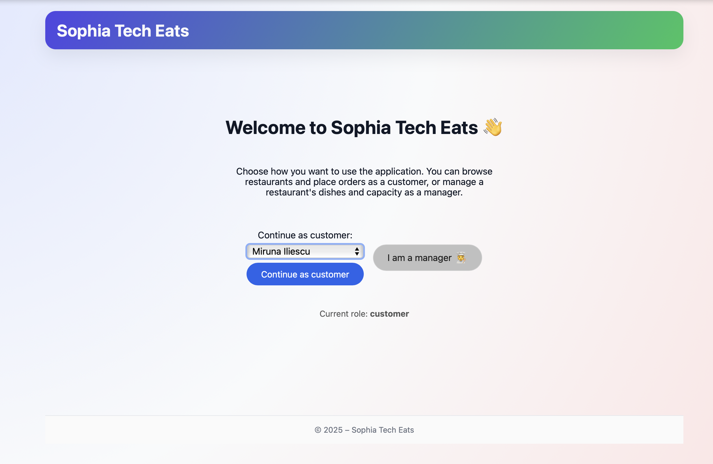 

---

## 🍽️ 2. Restaurant List

Displays all available restaurants, filtered by opening hours and availability.

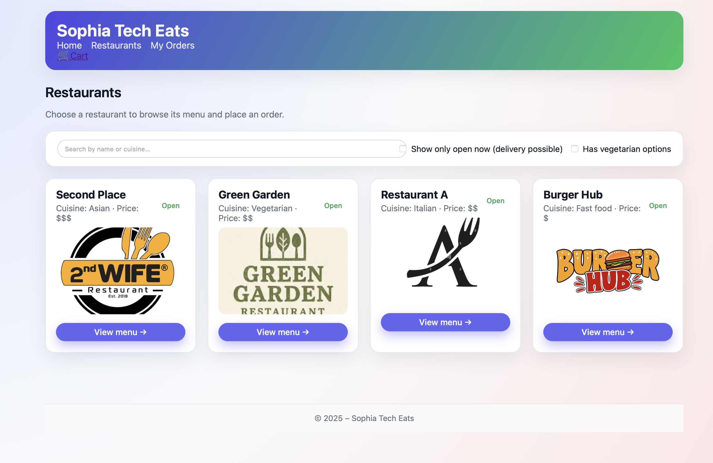

---

## 📋 3. Restaurant Menu

Each restaurant menu shows:
- dish categories
- prices
- descriptions
- available extras

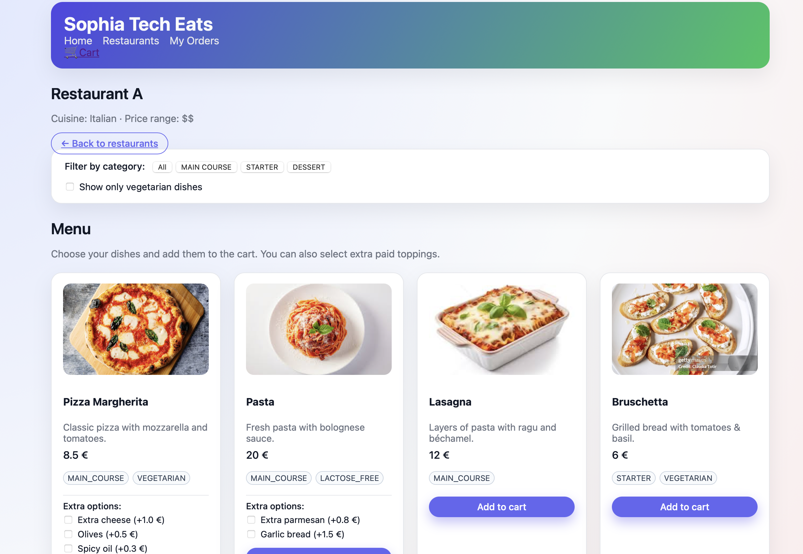
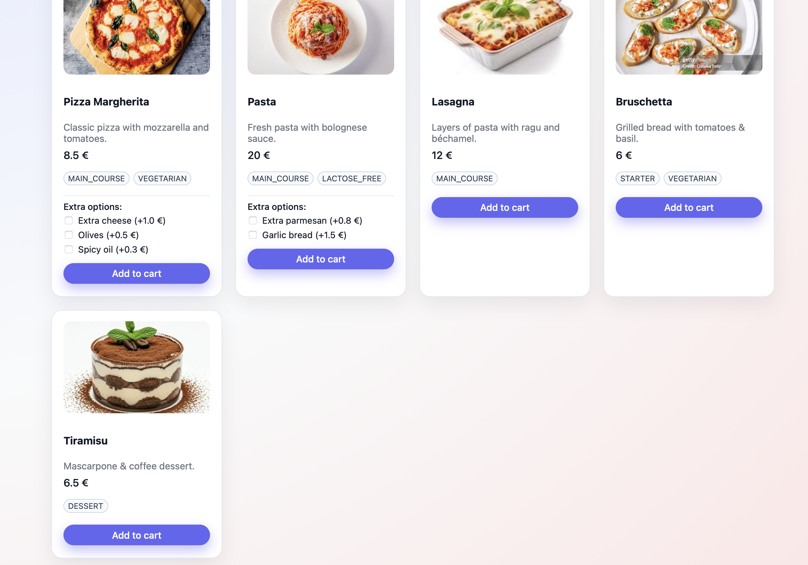
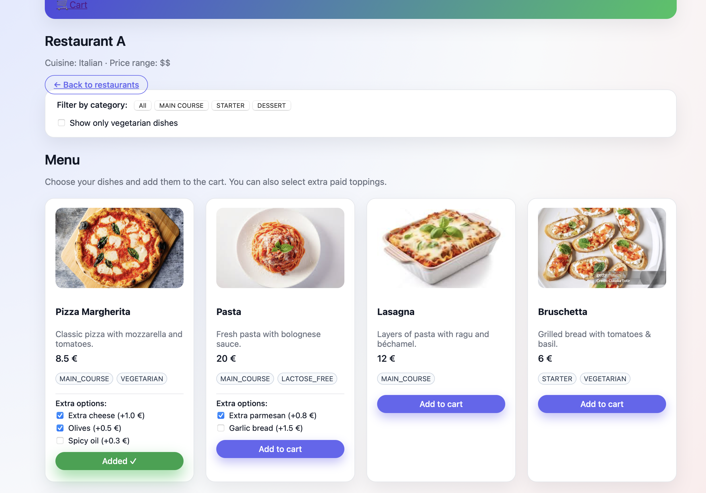

---

## 🛒 4. Cart & Delivery Options

Users can:
- review selected dishes
- choose delivery location
- select an available delivery time slot

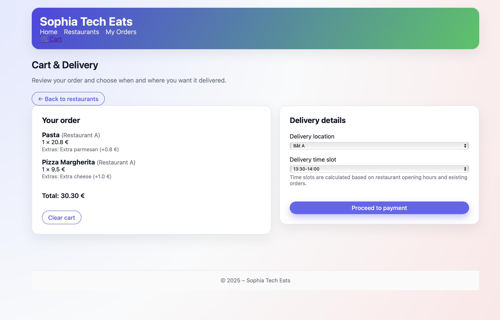

---

## 💳 5. Payment & Order Confirmation

The user validates the order.  
Payment is processed through a mocked payment proxy, as required.

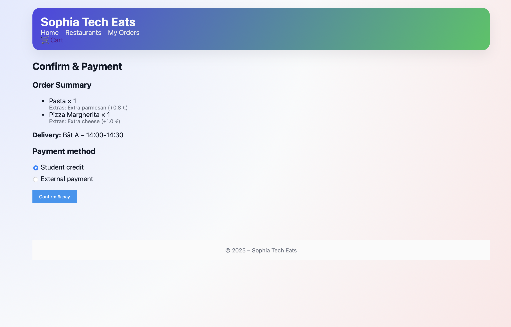
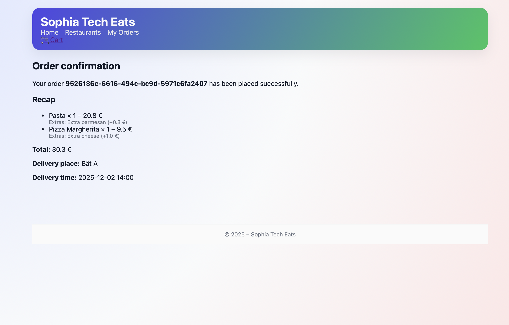
---

## 🧑‍🍳 6. Manager – Add New Dish

Managers can:
- create new dishes
- edit or delete existing menu items
- modify delivery capacity

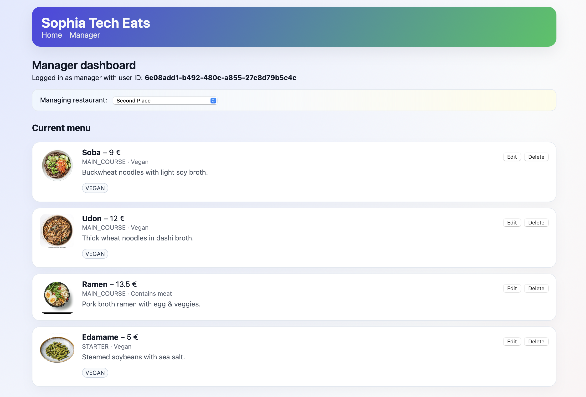
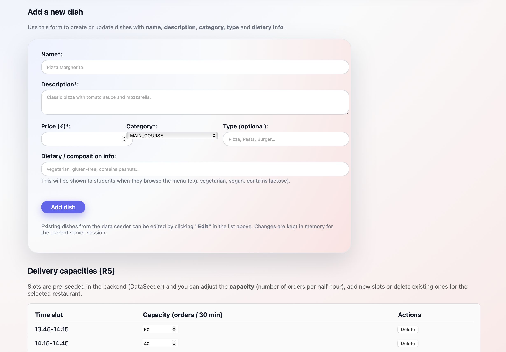
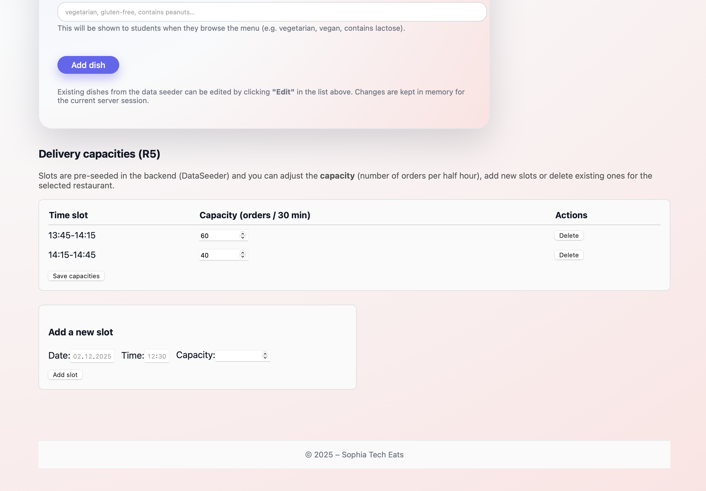
---

